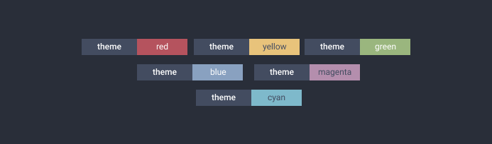

<div align="center">
  
  
  
  Quirky little node-js library for generating badges for your cli apps.
  
  
  [](https://www.npmjs.com/package/cli-badges)
  
</div>

---

## Table Of Contents

- [Table Of Contents](#table-of-contents)
- [Getting Started](#getting-started)
  - [Installing](#installing)
  - [Usage](#usage)
- [Available Options](#available-options)
- [Colors](#colors)
- [Styles](#styles)
- [Links](#links)
- [Themes](#themes)
- [Other Libraries?](#other-libraries)

---

## Getting Started

### Installing

As usual, you need to install from npm/yarn:

```
$ npm install cli-badges
```

### Usage

This is a simple example, using badges to display test results:

```js
const { badge } = require('cli-badges');

const failedBadge = badge('failed', '2', {
  messageBg: 'red',
});
const skippedBadge = badge('skipped', '2', {
  messageBg: 'yellow',
  messageColor: 'white',
});
const successBadge = badge.green('success', '2');

console.log(failedBadge, successBadge, skippedBadge);
```

The above would output something similar to the terminal:


You could also create a donate badge with a link ([if supported](#links)):

```js
const donateBadge = badge.blue('❤️ donate', 'ko-fi', {
  link: 'https://ko-fi.com/logginjs',
});

console.log(donateBadge);
```


You can also only show the label:

```js
const onlyLabel = badge('❤️ donate', '', { labelColor: 169 });

console.log(onlyLabel);
```

> ###### Example output is a mock, console output will vary slightly from terminal to terminal.

## Badge Structure <!-- omit in toc -->

A badge is conformed of a label and a message `<label>:<message>`. Each segment can be customized, by changing bg color, text color and style.

## API <!-- omit in toc -->

`cli-badges` exports a method called `badge`.

```ts
export function badge(
  label?: string,
  message?: string,
  options?: {
    labelBg?: string | number;
    messageBg?: string | number;
    labelColor?: string | number;
    messageColor?: string | number;
    labelStyle?: string;
    messageStyle?: string;
    labelWidth?: number;
    messageWidth?: number;
    link?: string;
    forceLink?: boolean;
    theme?: string;
    swapTheme?: boolean;
  }
): string;
```

## Available Options

| Option         | Description                                                                               | Type             | Default          |
| :------------- | :---------------------------------------------------------------------------------------- | :--------------- | :--------------- |
| `messageBg`    | Background [color](#colors) for the label                                                 | string or number | blue             |
| `labelBg`      | Background [color](#colors) for the message                                               | string or number | blackBright      |
| `messageColor` | Text [color](#colors) for the message                                                     | string or number | white            |
| `labelColor`   | Text [color](#colors) for the label                                                       | string or number | white            |
| `labelWidth`   | Width of the label                                                                        | number           | label length + 2 |
| `messageWidth` | Width of the message                                                                      | number           | label length + 2 |
| `labelStyle`   | Style for the label text                                                                  | string           | `null`           |
| `messageStyle` | Style for the label text                                                                  | string           | `null`           |
| `link`         | Add a link when a badge is clicked (_only works in some terminals, see [this](#links)_)   | URL              | `null`           |
| `forceLink`    | Force adding link even if not supported                                                   | boolean          | `false`          |
| `theme`        | Theme to be used, see [all themes](./docs/themes.md)                                      | string           | `blue`           |
| `swapTheme`    | Swap the theme, this means properties from label will be aplied to message and vice versa | boolean          | `false`          |

## Colors

`cli-badges` uses [`cli-color`](https://github.com/medikoo/cli-color#colors) internally for managing colors, you can check the list of available colors there. Take into account that when setting a color you don't need to pass the prefix `bg`, it's handled for you. ie: `blackBright` instead of `bgBlackBright`

#### Xterm colors <!-- omit in toc -->

There are more colors available using xterm colors, see [cli-color xterm colors](https://github.com/medikoo/cli-color#xterm-colors-256-colors-table) for the complete list of available colors.

> **Not supported on Windows and some terminals.** However if used in not supported environment, the closest color from basic (16 colors) palette is chosen.

## Styles

**cli-badges** uses [`cli-color`](https://github.com/medikoo/cli-color#styles) internally for managing styles, you can check the list of available styles there.

> Styles will display correctly if font used in your console supports them.

## Links

You can output badges with a link attached to it, that can be clicked in some terminals.

> #### ⚠︎ cli-badges will only output link if its supported by your terminal.

> See [this](https://gist.github.com/egmontkob/eb114294efbcd5adb1944c9f3cb5feda) for information on supported terminals

```js
badge('with', 'link', { link: 'https://link.com' });
```

## Themes



Themes are a way to store badge configuration for repeated use. All the options (_except for the theme option, obviously_) that are needed by the badge can be stored by making a theme.

The library comes with a set of inbuilt themes:

#### Inbuilt Themes <!-- omit in toc -->

- **red** : Red Message Background
- **green** : Green Message Background
- **blue** : Blue Message Background
- **yellow** : Black Colored Message on Yellow Background
- **cyan** : Black Colored Message on Cyan Background
- **magenta** : Black Colored Message on Magenta Background
- **success** : (_'Success'_) Message on Green Background
- **failed** : (_'Failed'_) Message on Red Background

#### Using Themes <!-- omit in toc -->

You can use the themes in various ways, passing an option `theme` to badge:

```js
badge('label', 'green', { theme: 'green' });
badge('label', 'magenta', { theme: 'magenta', swapTheme: true });
```

Or there are helper methods for ease of use:

```js
badge.green('label', 'green');
badge.failed('theme', 'red');
```

Options present in the theme will override options passed. Missing options will have default values.

### Adding a theme <!-- omit in toc -->

You can also add you own themes:

```js
badge.addTheme('donate', {
  label: '❤️ donate',
});

badge('', 'ko-fi', { theme: 'donate' });
badge.donate('', 'ko-fi');
```


> You can also send in a PR and suggest a new inbuilt theme :)

### Swap Properties <!-- omit in toc -->

You can also **swap** all themes, this means properties from label will be aplied to message and vice versa.

```js
badge.failed('theme', 'red');
badge.failed.swap('theme', 'red');
```


You can check the complete list of themes [here](./docs/themes.md).

## Other Libraries?

**cli-badges** is also available in other languages:

- `Python` [@haideralipunjabi/cli-badges](https://github.com/haideralipunjabi/cli-badges)
- `Deno` [@Delta456/cli_badges](https://github.com/Delta456/cli_badges)

## Test Coverage <!-- omit in toc -->

| Statements                                                                  | Branches                                                                  | Functions                                                                  | Lines                                                                  |
| --------------------------------------------------------------------------- | ------------------------------------------------------------------------- | -------------------------------------------------------------------------- | ---------------------------------------------------------------------- |
|  |  |  |  |

## Support the project <!-- omit in toc -->

I tend to open source anything I can, and love to help people that need help with the project.

However, if you are using this project and are happy with it or just want to encourage me to continue creating stuff, there are few ways you can do so:

- Starring and sharing the project 🚀
- Reporting bugs 🐛
- Sending feedback
- Or even coding :P

Thanks! ❤️

---

Contributions are very welcomed 🥰
